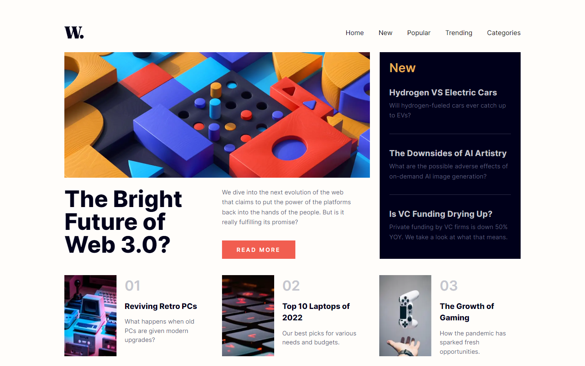

# Frontend Mentor - News homepage solution

This is a solution to the [News homepage challenge on Frontend Mentor](https://www.frontendmentor.io/challenges/news-homepage-H6SWTa1MFl). Frontend Mentor challenges help you improve your coding skills by building realistic projects.

## Table of contents

- [Overview](#overview)
  - [The challenge](#the-challenge)
  - [Screenshot](#screenshot)
  - [Links](#links)
- [My process](#my-process)
  - [Built with](#built-with)
  - [What I learned](#what-i-learned)

## Overview

### The challenge

Users should be able to:

- View the optimal layout for the interface depending on their device's screen size
- See hover and focus states for all interactive elements on the page

### Screenshot

### Links

- Solution URL: [https://github.com/sjohnston82/news-homepage](https://github.com/sjohnston82/news-homepage)
- Live Site URL: [https://storied-biscochitos-f7a7c1.netlify.app/](https://storied-biscochitos-f7a7c1.netlify.app/)

## My process

### Built with

- Semantic HTML5 markup
- CSS custom properties
- Flexbox
- Mobile-first workflow
- NextJs
- TailwindCSS
  -Framer-motion

### What I learned

This one was a fun challenge, I enjoyed using framer-motion to animate the mobile menu, and to figure out the best way to go about darkening the rest of the content when the menu was visible.

I initially tried to use CSS Grid to lay out the desktop version, but I was having a hard time getting it to line up just right, so I switched over to Flexbox.

## Author

- Website - [Stephen Johnston](https://www.stephenmjohnston.net)
- Frontend Mentor - [@sjohnston82](https://www.frontendmentor.io/profile/sjohnston82)
